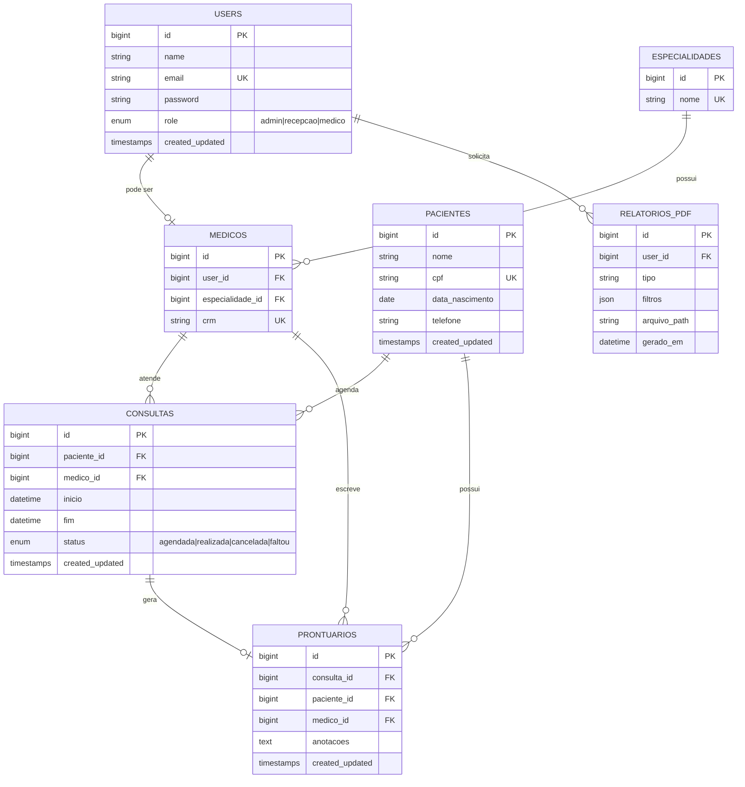

# Diagrama do banco

```mermaid
erDiagram
    USERS ||--o| MEDICOS : "pode ser"
    ESPECIALIDADES ||--o{ MEDICOS : "possui"
    PACIENTES ||--o{ CONSULTAS : "agenda"
    MEDICOS ||--o{ CONSULTAS : "atende"
    CONSULTAS ||--o| PRONTUARIOS : "gera"
    MEDICOS ||--o{ PRONTUARIOS : "escreve"
    PACIENTES ||--o{ PRONTUARIOS : "possui"
    USERS ||--o{ RELATORIOS_PDF : "solicita"

    USERS {
        bigint id PK
        string name
        string email UK
        string password
        enum role "admin|recepcao|medico"
        timestamps created_updated
    }
    ESPECIALIDADES {
        bigint id PK
        string nome UK
    }
    MEDICOS {
        bigint id PK
        bigint user_id FK
        bigint especialidade_id FK
        string crm UK
    }
    PACIENTES {
        bigint id PK
        string nome
        string cpf UK
        date data_nascimento
        string telefone
        timestamps created_updated
    }
    CONSULTAS {
        bigint id PK
        bigint paciente_id FK
        bigint medico_id FK
        datetime inicio
        datetime fim
        enum status "agendada|realizada|cancelada|faltou"
        timestamps created_updated
    }
    PRONTUARIOS {
        bigint id PK
        bigint consulta_id FK
        bigint paciente_id FK
        bigint medico_id FK
        text anotacoes
        timestamps created_updated
    }
    RELATORIOS_PDF {
        bigint id PK
        bigint user_id FK
        string tipo
        json filtros
        string arquivo_path
        datetime gerado_em
    }
```
