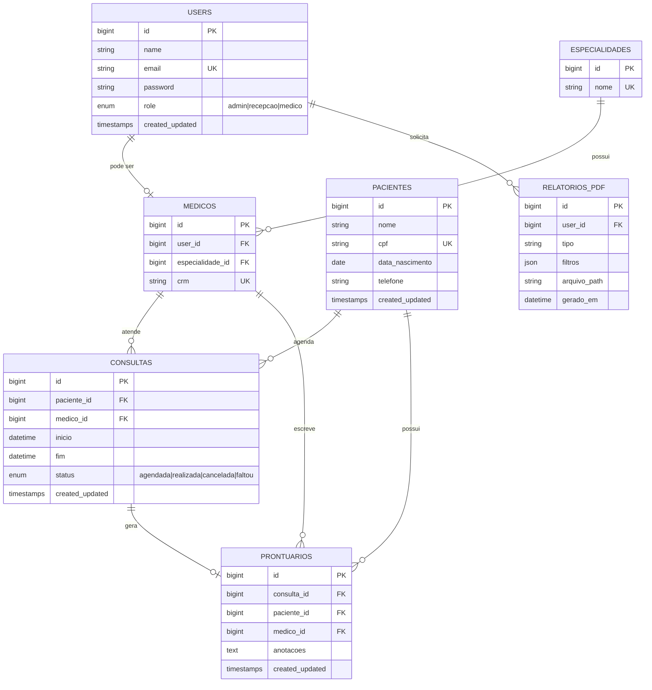

# CiniGo

Sistema de gestão ambulatorial para clínicas de pequeno porte. Projeto de portfólio que simula uma arquitetura real de empresa.

## O que faz

- Autenticação com papéis: admin, recepção e médico
- Cadastro de pacientes, médicos e especialidades
- Agendamento de consultas com validação de conflito de horário
- Prontuário por consulta, com acesso restrito ao médico responsável
- Relatórios em PDF gerados por um serviço Java independente

## Stack

| Camada | Tecnologia |
|---|---|
| Aplicação principal | Laravel (PHP) |
| Banco de dados | MySQL |
| Serviço de relatórios | Java puro + JDBC + OpenPDF |
| Infra | Docker Compose |

## Aviso

Todos os dados são fictícios (Faker). Este é um MVP de estudo, não deve ser usado com dados reais de pacientes.

# Diagrama do banco

